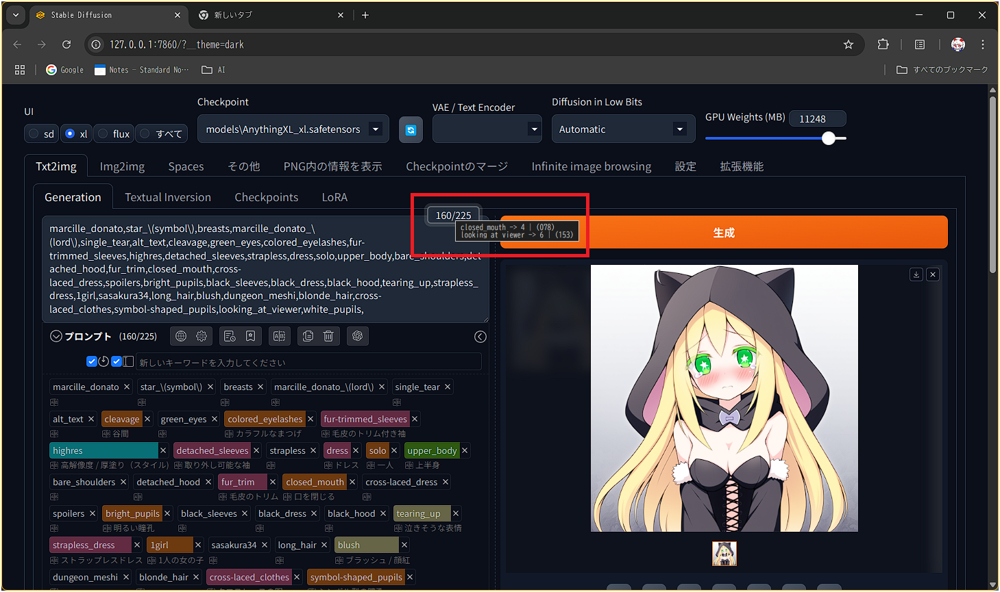

# sd-webui-75-token-visualizer

> ⚡️ Stable Diffusion WebUI Forge 拡張機能  
> プロンプトを 75 トークンごとに自動で分割し、トークンカウンター隣に表示します。

---

## 🎯 特徴

- **元ソースを変更不要**  
  モンキーパッチ方式で `modules.ui.update_token_counter` を拡張。元のコードには一切手を加えません。

- **プロンプトをトークンごとに分割**  
  長いプロンプトも視覚的に把握しやすくなります。

- **軽量・CSS カスタマイズ対応**  
  サイドパネルやテーブルの行に専用クラスを割り当てているので、`style.css` をいじって見た目を自由に変更可能。

---

## 🖼️ 見た目

### ホバーでツールチップ表示
プロンプト入力欄にマウスを乗せると、75トークンチャンクの内容がツールチップでポップアップします。



> 図1: プロンプト上でホバーしたときにチャンク情報がツールチップで表示される様子

---

### クリックで表を表示
ツールチップをクリックすると、より詳細な75トークン区切りのチャンク表がモーダル（またはパネル）で展開されます。


> 図2: ツールチップをクリックすると開く、チャンク一覧のテーブル表示

---

## 🚀 インストール

1. リポジトリをクローンまたは ZIP をダウンロード  
   ```bash
   cd stable-diffusion-webui-forge/extensions
   git clone https://github.com/weizlogy/sd-webui-75-token-visualizer.git
